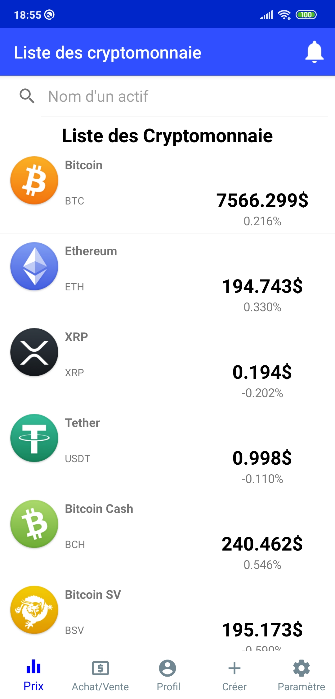
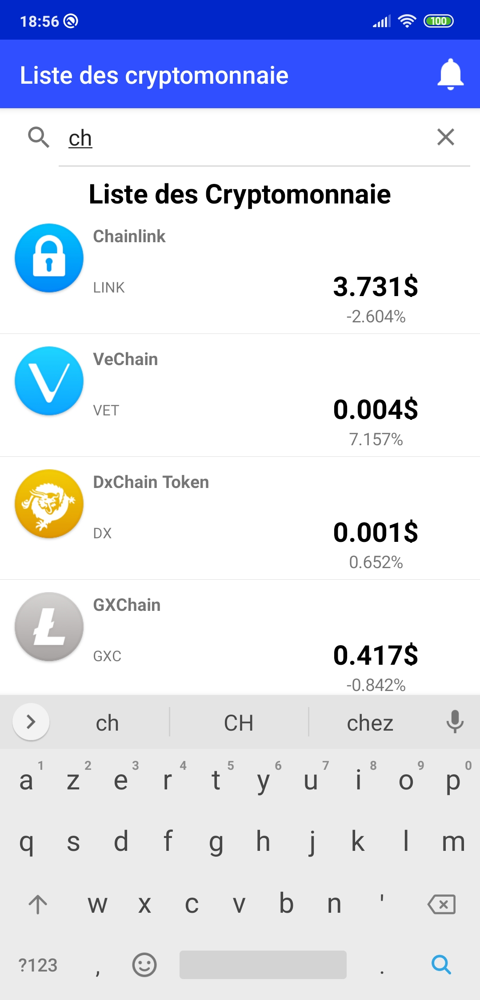
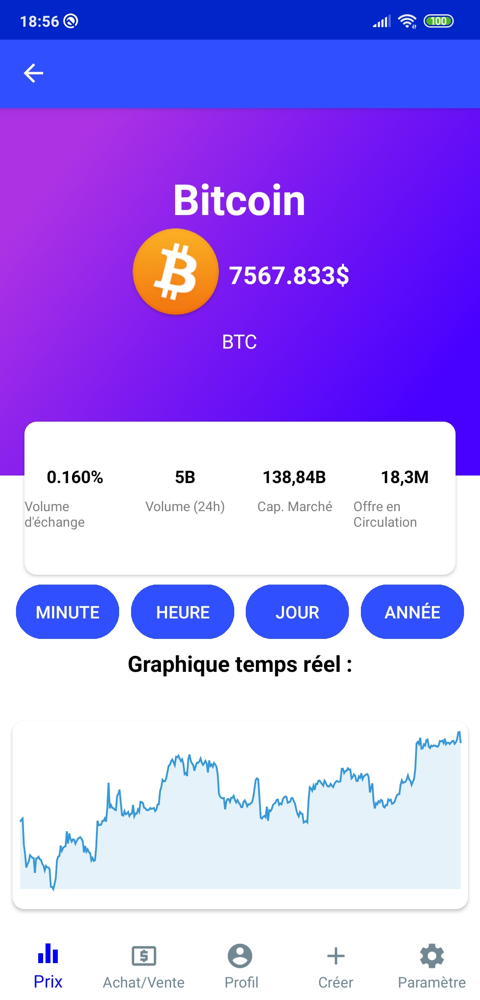
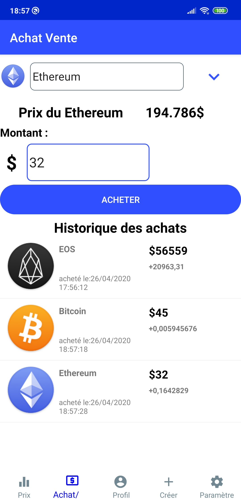
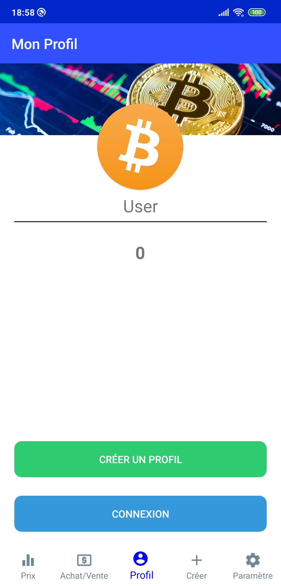
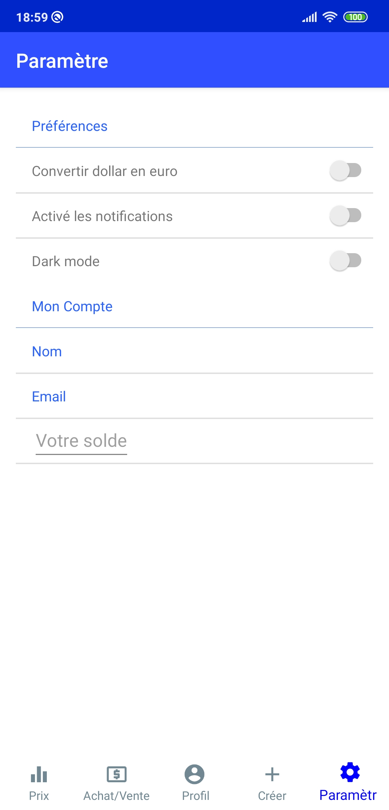
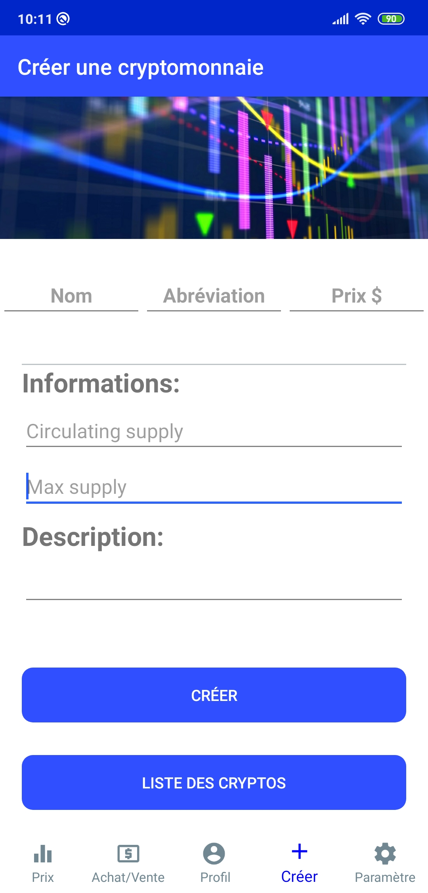

<h1 align="center">Bienvenue sur CoinHybridApp
 👋</h1>
<p align="center">

</p>
<p>
  
  <a href="https://github.com/AnthonY-Dole/CoinAppProject/blob/master/README.md" target="_blank">
    
  </a>
  <a href="https://github.com/kefranabg/readme-md-generator/graphs/commit-activity" target="_blank">
    
  </a>
</p>

## Resumé :bookmark_tabs:

>CoinHybridApp
 et une application pour le marché des cryptomonnaies. Avec ces différents éléments, CoinHybridApp
 permet de faire un pas vers le monde de la cryptomonnaie avec différentes parties qui vont vous aider à assimiler ce qu'est une cryptomonnaie. :moneybag:

### 🏠 [PagePrincipale](https://github.com/AnthonY-Dole/CoinHybridApp)

## Navigation

<p align="center">
 
 
 
 
 
 
  
</p>

## Lien du cahier des charge
* [cahier des charge](https://docs.google.com/document/d/1bb34p5BNpaevR5uX_ln8dcOfPDYpZjAMtMcyFkAWfGo/edit#heading=h.8nenr8bbznpo)


## Prérequis :warning:

- Android 6.0
- Internet


## Teléchargement
Lien rapide:


## Installation 

```sh
Installer l'apk de l'application.
```

## Utilisation

* [Visual Studio](https://visualstudio.microsoft.com/fr/)
* [Git](https://git-scm.com/)
* Cloner le projet .
* Avoir un émulateur ou un appareil android.
* Lancer le projet.


## Captures d'écran
* <p>Sera fait à la fin du projet</p>


</p>

## Requis

```sh
Internet recommandé.
```
## Commentaires

```sh
Le code est fonctionnel, certaines parties peuvent-être encore améliorées, l'optimisation de l'application peut-être meilleure.
```

## Créateurs de l'application et du README.md

👤 **Anthony Dole / Adrien Vuillaume / Kevin Guillermin **

* GitHub: [@AnthonY-Dole ](https://github.com/AnthonY-Dole )
* GitHub: [@AVuillaume ](https://github.com/AVuillaume )
* GitHub: [@KGuillermin ](https://github.com/KGuillermin )

## 🤝 Contributions

Les contributions, problèmes et demandes de fonctionnalités sont les bienvenues ! <br />N'hésitez pas à vérifier [issues page]( https://github.com/AnthonY-Dole/CoinHybridApp/issues). Vous pouvez également consulter le [contributing guide]( https://github.com/AnthonY-Dole/CoinHybridApp/graphs/contributors).

## Montrez votre soutien

Donnez un ⭐️ si ce projet vous a aidé!

***
